# CockroachDB: The distributed database

In the era of cloud computing, traditional centralized database architectures are increasingly giving way to more flexible and resilient distributed database architectures. Since the cloud is, by definition, a distributed system, the architecture of traditional relational databases frequently conflicts with the architectural needs of modern cloud-native applications: elasticity, horizontal scale, and separation of concerns.

The distributed database arose as the answer to this conflict, and they are becoming mainstream, too. Distributed databases, which store and process data across multiple nodes or locations, offer a range of advantages that address the growing demands for scalability, availability, and performance in modern applications.

Here, we delve into the numerous benefits of distributed database architecture, highlighting how it enhances data management capabilities and supports the dynamic needs of today's digital enterprises. From improved fault tolerance to seamless scalability and enhanced data locality, we will explore why organizations adopt distributed databases to advance their data-driven initiatives.

## Types of Distributed Databases

SQL databases, invented by Edgar F. Codd, use tables and schemas to store and relate data. They became the standard for data storage in the 1970s due to their support for [ACID transactional guarantees](https://www.youtube.com/watch?v=M6zbQ5_sgq8) (Atomicity, Consistency, Isolation, Durability). However, their inability to scale easily and operate efficiently in cloud environments led to the development of NoSQL databases, which are cloud-native, resilient, and horizontally scalable.

NoSQL databases, however, sacrifice strict schema enforcement and ACID guarantees, which can compromise data consistency and correctness in transactional workloads.

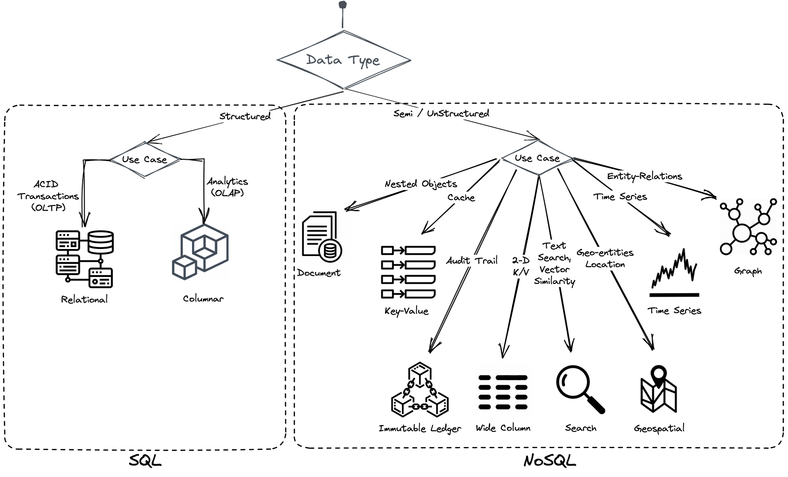

In recent years, distributed SQL databases, also known as “new SQL,” have emerged to combine the advantages of NoSQL (cloud-native scalability and resilience) with the strict schema and ACID guarantees of traditional relational databases. These databases do not require manual sharding and offer ACID guarantees, making them ideal for transactional workloads and applications requiring high data consistency.

Today, [both NoSQL and distributed SQL databases are widely used](https://www.cockroachlabs.com/blog/what-is-a-distributed-database/#Types-of-distributed-databases:-NoSQL-vs.-distributed-SQL-databases). NoSQL databases are preferred for analytics and big data workloads, while distributed SQL databases are favored for transactional workloads and applications where data consistency is critical.

## Principles of Distributed Databases

What is a distributed database? Distributed databases have become a cornerstone of modern data management, offering robust solutions for handling large-scale, high-performance applications. Understanding the fundamental principles of distributed database architectures is essential for leveraging their full potential. These principles outline the core characteristics and operational frameworks that make distributed databases powerful and versatile.

### Distribution of Data

Data in a distributed database is stored across multiple physical locations. These locations could be different servers, data centers, or even geographically dispersed regions. Suppose a single-instance database goes offline (due to a power outage, machine failure, scheduled maintenance, or anything else). In that case, all the application services that rely on it will also go offline.

In contrast, distributed databases handle outages by splitting data into smaller, manageable pieces (sharding) and replicating them across multiple physical locations. So, if a server goes offline, your data will still be reachable on the other servers.

Distributed systems use load-balancing techniques to distribute workloads evenly across multiple nodes. The system can handle more requests simultaneously by preventing any single node from becoming a bottleneck. In addition, efficient load balancing ensures that no single node is overwhelmed, maintaining system stability and performance.

Distributed systems also enable parallel processing, where tasks are divided and processed simultaneously across multiple nodes. Large tasks can be broken down into smaller, parallel tasks, significantly speeding up processing times.

Another advantage of distributed systems is that data can be stored closer to where it is needed, reducing latency and improving access times. You can also pin your data to a specific location to comply with geographical-blocking regulations ([GDPR](https://www.cockroachlabs.com/customers/iam-on-cockroachdb-dedicated/), for example).

Finally, distributed systems can isolate resources for different tasks or tenants, improving performance and security. Different users or applications can share the same infrastructure while being isolated from each other, enhancing resource efficiency ([multi-tenancy](https://www.cockroachlabs.com/blog/6-takeaways-multitenancy-saas-webinar/)).

### Scalability

As applications grow to serve more users, the storage and computing requirements for the database will increase over time — and not always at a predictable rate.

Trying to keep up with this growth when using a single-instance database is difficult—you either have to:

1. Pay for more resources than you need so that your database has “room to grow” in terms of storage and computing power, or
2. Navigate regular hardware upgrades (vertical scalability) and migrations to ensure the database instance is always running on a machine capable of handling the current load.

Distributed databases, in contrast, can scale horizontally simply by adding additional instances or nodes. So, if your workload is facing a demand peak, predictable or not, you can add nodes to your cluster, and your database should transparently handle the increased load (linear scalability).

**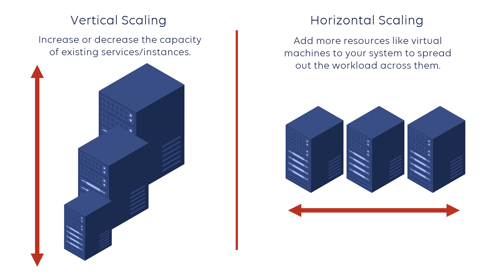**

Moreover, in serverless distributed databases, nodes can be dynamically added or removed based on demand. Resources are provisioned only when needed, reducing waste and optimizing costs. The system can handle [sudden spikes in traffic](https://www.cockroachlabs.com/big-ideas-podcast/dom-scandinaro-cameo/) without compromising performance or availability. So, your database is neither under-provisioned nor over-provisioned, which optimizes the TCO of your infrastructure.

### Transparency

Distributed databases aim to present a unified view of the data to the end-user, regardless of where the data is physically stored. You can spread your cluster over multiple countries and/or continents. However, data is still transparently exposed to end-users without any clue about its storage location (location transparency).

In distributed databases like CockroachDB, the system hides the complexities of data replication (keyspace sharding into ranges and distribution of ranges) from the user. End-users do not need to know the physical location of the data since the system exposes it as a single logical database with a unique endpoint (replication transparency).

Moreover, the system remains available during failure, and recovers afterward. For instance, if a node goes offline (due to a power outage, machine failure, or anything else), the cluster continues uninterrupted. The cluster will even try to repair itself by re-replicating missing data to other nodes. So, end-users always operate uninterrupted at any condition (failure transparency).

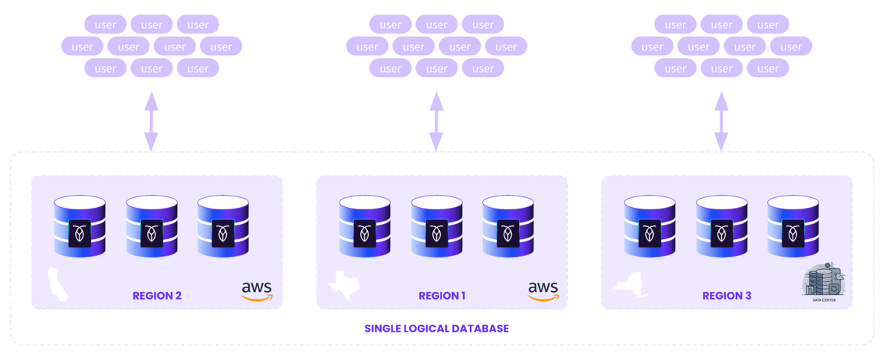

### Reliability and Availability

Data replication and fault tolerance mechanisms achieve reliability and high availability. Distributed databases inherently offer advanced fault tolerance and resilience mechanisms, making them ideal for maintaining high availability and robust disaster recovery.

Data replication is a fundamental strategy in distributed databases to ensure data availability and durability. Data is written to multiple nodes simultaneously, and all copies must be updated before a transaction is considered complete. This provides strong consistency and ensures immediate failover with minimal data loss.

Distributed databases employ redundancy and automated failover to maintain service continuity. Multiple copies of data are maintained across different nodes. If one node fails, the system automatically reroutes requests from a failed node to a healthy node that can serve the data, ensuring high availability.

In this way, distributed databases can detect and recover from failures automatically. The system continuously monitors node health and performance. Thus, it can automatically isolate and repair failed nodes, restoring normal operations.

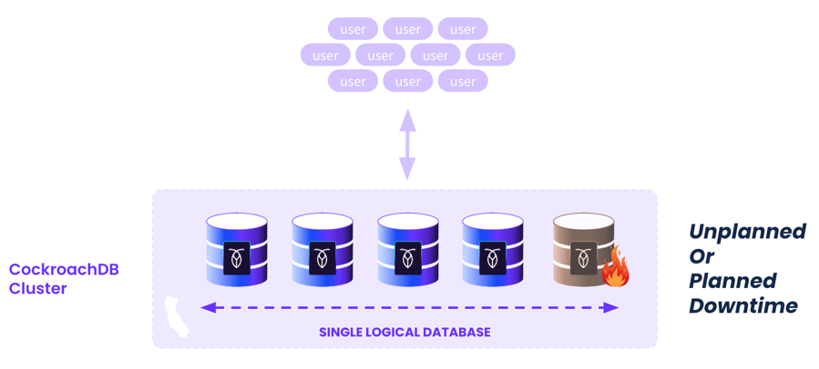

This feature can also be leveraged at a regional level. Based on your survivability goals, you can lose an entire region without losing your data.

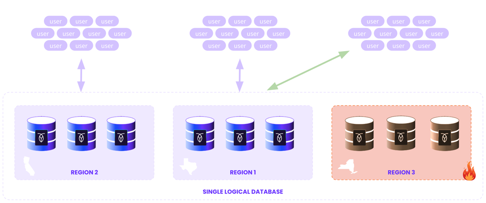

For this capability, distributed databases rely on consensus protocols such as Paxos and [Raft](https://www.cockroachlabs.com/docs/stable/architecture/replication-layer#technical-details-and-components) (Replication And Fault Tolerance) which achieve consensus across distributed nodes. The consensus is made by quorum-based mechanisms, ensuring that a majority of nodes agree on a transaction before it is committed. So, nodes must agree on the state of the data or the order of transaction, and a transaction is considered successful only if a quorum of nodes approves it. Thus, the system ensures data integrity and consistency even in the presence of node failures. These protocols balance consistency and availability in a partitioned system ([CAP theorem](https://www.cockroachlabs.com/docs/stable/frequently-asked-questions.html#how-is-cockroachdb-both-highly-available-and-strongly-consistent)).

### Decentralized Management

Decentralized management is fundamental to distributed databases, distinguishing them from traditional, centralized database systems. This approach distributes control and management across multiple nodes, enhancing the system's overall scalability, fault tolerance, and resilience. In a decentralized system, each node operates independently while coordinating with other nodes - through consensus protocols - to manage data and handle transactions.

In addition, decentralized management enables better load balancing and resource distribution. By preventing any single node from becoming a bottleneck, the system can utilize its resources more effectively, improving performance.

Finally, decentralized management allows every node in the cluster to adapt quickly to changes in workload patterns and data distribution. This flexibility makes them well-suited for dynamic environments where data access patterns vary over time.

## Challenges of Distributed Databases

Distributed databases offer several advantages, such as scalability and resilience. CockroachDB, for example, provides features like treating the database as a single-instance deployment and offering CDC ([change data capture](https://www.cockroachlabs.com/blog/change-data-capture/)) change feeds for event-driven applications, simplifying developer workflows. However, distributed databases also come with potential downsides:

1. **Increased Operational Complexity**: Managing a distributed database can be more complex than a single-instance DB, though managed DBaaS (database as a service) options can alleviate this.
2. **Learning Curve**: Teams might need time to adapt to new best practices, especially with NoSQL databases that may use proprietary query languages.

Additional factors include cost, which can vary based on the chosen database, deployment method, workload requirements, and configuration. While distributed databases might seem more expensive due to multiple instances, they can prove to be cost-effective by preventing [the high financial costs of downtime](https://www.cockroachlabs.com/guides/the-state-of-resilience-2025/). Managed DBaaS can also reduce operational burdens, potentially making them more economical in the long run.

Organizations typically invest significant resources in testing and evaluating database options to determine which is best for their budget and requirements.

## Distributed Database Configurations

A distributed database's primary objective is to ensure high availability, meaning the database and all its data remain accessible at all times. In a distributed system, data is replicated across multiple physical instances, and there are various methods for configuring these replicas:

1. **Active-passive**: An active-passive configuration routes all traffic to a single active replica, with data then copied to passive replicas for backup. For example, in a three-node setup, data is written to node 1 (active) and copied to nodes 2 and 3 (passive). This method is straightforward but introduces potential issues:
    1. _Synchronous Replication_**:** Ensures consistency but can sacrifice availability if any replica fails.
    2. _Asynchronous Replication_**:** Maintains availability but can lead to data inconsistencies or loss.

Active-passive setups are simple but involve trade-offs affecting database availability and consistency.

1. **Active-Active**: In an active-active configuration, multiple active replicas handle traffic simultaneously, ensuring high availability, as other replicas can manage traffic if one goes offline. This setup, however, is more complex to configure and can still face consistency issues during outages.
    For instance, if one active replica (A) receives a write and fails before the data is replicated to another replica (B), subsequent reads from B may not reflect the latest write, leading to inconsistencies. Careful configuration and testing are essential to mitigate such risks.

2. **Multi-Active**: CockroachDB is an example of a database that uses a multi-active configuration, enhancing availability beyond active-passive and active-active setups. In a multi-active system, all replicas can handle reads and writes.

However, unlike active-active, multi-active eliminates inconsistencies using a consensus replication system. Writes are committed only when a majority of replicas confirm receipt, defining correctness by majority consensus. This approach ensures the database remains consistent and online even if some replicas are offline. If a majority are offline, the database becomes unavailable to prevent inconsistencies.

## How a distributed database works

Distributed databases are inherently complex. While this article won't delve into every detail, it will provide a high-level overview of how a distributed SQL database operates.

### Replication

From your application's perspective, a distributed database functions like a single-instance database — you connect to it and send data similarly. However, once the data reaches the database, it is automatically replicated and distributed across three or more nodes (individual instances of the distributed database).

To illustrate this process, let's focus on a single chunk of data (called range in CockroachDB) being written to the database in a three-node, single-region cluster. Though databases like CockroachDB support multi-region deployments and a large number of nodes, this example simplifies the explanation.

When data in a range is sent to the database, it is written into three replicas —one on each node. One of these nodes is designated as the “[leaseholder](https://www.cockroachlabs.com/docs/stable/architecture/life-of-a-distributed-transaction#leaseholder-node)” for this range, coordinating read and write requests for the data. However, any node can receive requests, distinguishing CockroachDB from active-passive systems where all requests must go through a central "Active" node.

Consistency between the replicas is maintained using the Raft consensus algorithm, ensuring that a majority of replicas agree on the data's correctness before committing a write.

### Consensus

Consensus is a fundamental problem in fault-tolerant distributed systems. Consensus involves multiple servers agreeing on values. Once they reach a decision on a value, that decision is final. Typical consensus algorithms make progress when any majority of their servers are available; for example, a cluster of five servers can continue to operate even if two servers fail. If more servers fail, they stop progressing (Quorum is not reached).

The Raft (Replication And Fault Tolerance) protocol is a consensus algorithm designed for distributed systems, introduced by Diego Ongaro and John Ousterhout in 2014. It is known for its simplicity and effectiveness, which has led to widespread industry adoption. Raft ensures that all nodes in a distributed system agree on a single state, even in the face of failures or network partitions. The key components of Raft are:

1. **Leader Election:** Nodes communicate to elect a leader responsible for making decisions and receiving client requests. If the leader fails, a new leader is elected through a voting process among the remaining nodes.
2. **Log Replication:** The leader maintains a log of all committed transactions and replicates these log entries to other nodes. Each node applies the log entries to its state machine to ensure consistency with the leader.
3. **Safety:** Raft ensures that a majority of nodes must agree on any decision before it is committed. This prevents conflicting decisions by different leaders.

Many distributed databases, like CockroachDB, use the Raft protocol to ensure consistency and reliability across its nodes. Raft allows CockroachDB to function as a multi-active system, where all nodes can receive read and write requests without risking consistency issues.

### Consensus: Prerequisite Concepts

To understand how Raft works, you need to know the following concepts:

- **Quorum**: If your distributed system has N nodes, you need at least (N/2) + 1 nodes to agree on a value—basically, you need a majority (more than 50%) votes to have consensus (just like any political election). A majority vote ensures that when (N/2) + 1 nodes are running and responding, at least one node contains the latest value for a given data across read and write requests, even if there is a network partition or other failure in the system.
- **Failure tolerance**: Under a quorum-based system, your cluster can tolerate N/2 node failures if N is odd. (N/2)-1 otherwise.
- **Cluster size**: Consider a cluster of four nodes; the majority required is three, and you can tolerate only one node failure. For a cluster of five nodes, the majority is still three, but you can tolerate two node failures. So, from a failure handling perspective, an even number of nodes does not add much value as fault tolerance is lesser. So, it’s better to choose odd-numbered nodes in production at a slightly higher cost, so you can tolerate more node failures!
- **Node States**: Raft nodes can be in three states: **_Leader_**, **_Follower,_** and **_Candidate_**. The leader is the source of truth. Logs always flow from the leader to the followers.
- **Log**: A log is a disk-based file where objects called log entries are usually added sequentially in binary data. In the Raft context, you can find two kinds of logs:
  - **Committed logs**: A log entry is committed only when the majority of the nodes in the cluster replicate it. A committed log never gets overridden. It is durable and eventually gets executed by all the nodes in the Raft cluster.
  - **Uncommitted logs**: If a client log entry is not yet replicated to the majority of the cluster nodes, it’s called an uncommitted log. Uncommitted logs can be overridden in a follower node.
- **State Machine**: Each node has its own state machine. Raft has to ensure that whatever log entries are committed are eventually applied to the state machine, which works as a source of truth for the data in memory.
- **Term** or **lease**: it represents a time period through which a node acts as a leader. The concept is based on logical time (not global time)—it’s just a counter managed by every node individually. Once a term terminates, another term starts with a new leader. Even though terms/leases across nodes may differ at a given time, Raft has a mechanism to sync and converge them to the same value.
- **RPC:** Nodes participating in Raft communicate with each other using a Remote Procedure Call (RPC) on top of TCP. This protocol is suitable for communication across data centers, internal systems, and services (not user-facing products or services). Raft uses two different RPC requests. At a high level:
  - **RequestVote (RV):** When a node wants to become a leader, it sends this request to other nodes to ask them to vote for it.
  - **AppendEntries (AE):** This message asks the followers to add an entry to their log file. The leader can send an empty message and a heartbeat, indicating to the followers that the entry is still alive.

### How Raft consensus works

For our explanation, we’ll use a five-node cluster. All the nodes start with a random timeout of empty logs and begin counting down.

As mentioned earlier, a node can be in different states depending on the cluster situation. To understand the state transition, let’s look at the following diagram:

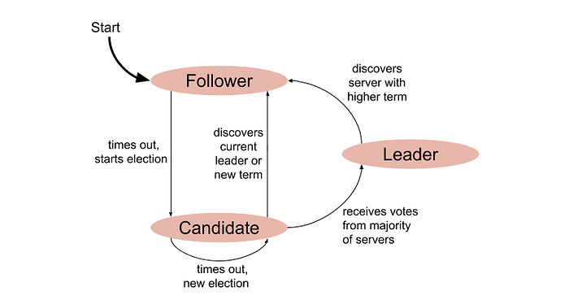

Each node starts from the **_Follower_** state. Once the election timeout is over, it enters the **_Candidate_** state—this means the node is now eligible to become a **_Leader_**. Once a candidate gets a clear majority of votes, it enters the Leader state.

If there is no clear winner during the election process, the candidate times out again, remains in the Candidate state, and a new election begins. To understand how a candidate can be elected as a cluster leader, let’s look at the following sequences:

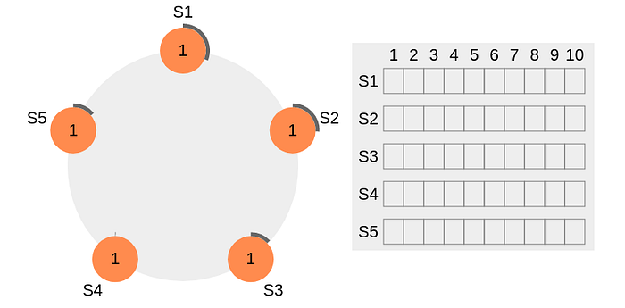

The thick black perimeter around the nodes represents time-out. Note that the perimeter lengths represent different timeout values for each node. Here, each node is initialized with the term = 1. S4 times out first, starts a new election process, and increments the local term’s value by 1. S4 votes for itself and sends a RequestVote (RV) message to all other nodes in the cluster.

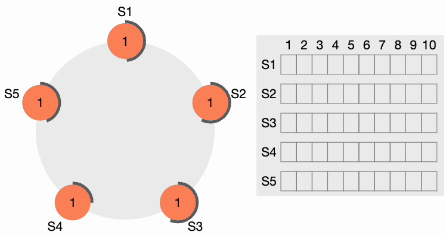

All other nodes receive the request. They first reset their local term to 2 since their current term is lesser, then grant a vote for the request. S4 gets a clear majority and becomes the leader. The thick black perimeter around S4 in the following figure indicates it has become the cluster leader:

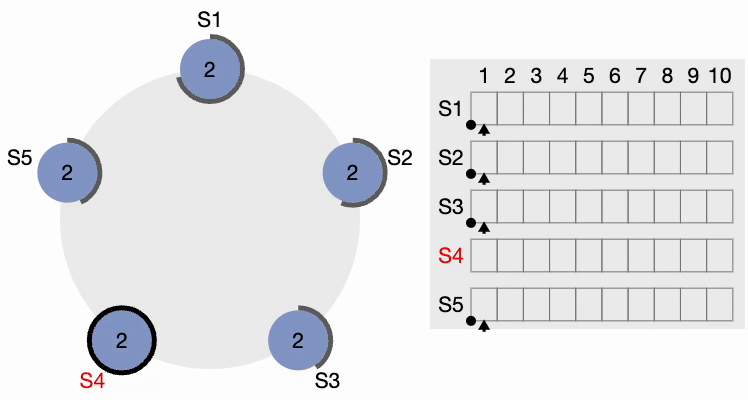

Now, S4 sends AppendEntries (AE) messages to all other nodes. Followers acknowledge each AppendEntries message. There is also something called “Heartbeat Timeout,” which should be configurable in the system. The leader keeps sending empty AppendEntries messages at intervals specified by the heartbeat interval, indicating that it’s still alive so that the cluster does not unnecessarily initiate another leader election process.

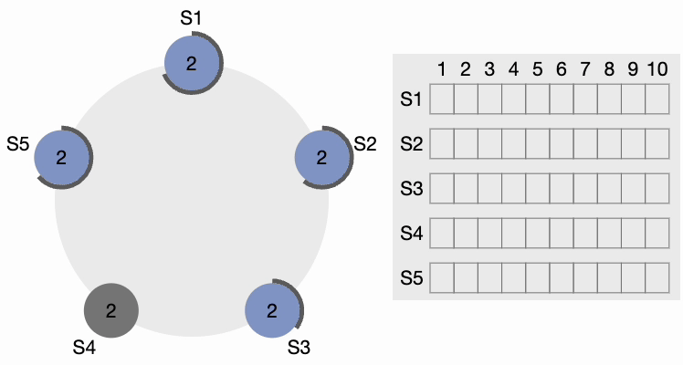

If a candidate gets a message from a newly elected leader, it steps down and becomes a Follower. If there is a network partition, the current leader might get disconnected from the majority of the cluster, and the majority now selects a new leader.

When the old leader comes back, it discovers that a new leader is already elected with a higher term, so the old leader steps down and becomes a Follower.

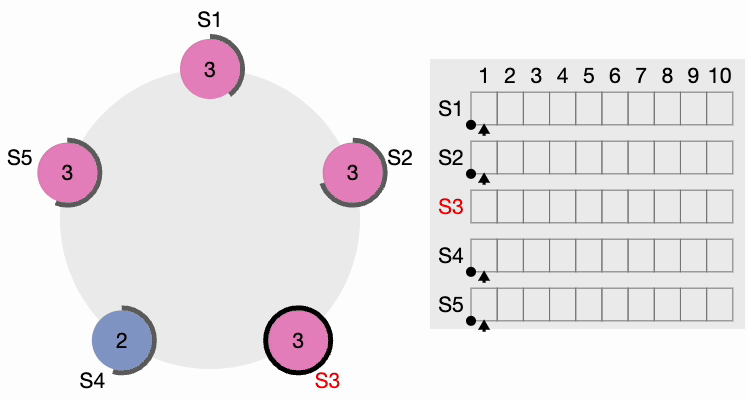

As you can see, the Raft consensus algorithm, developed to ensure reliability in distributed systems, enables nodes to agree on a single state, even in failure scenarios. Raft operates by electing a leader from among nodes, who then coordinates transaction logs to maintain system consistency. This consensus process involves nodes transitioning between three states—Follower, Candidate, and Leader—to ensure only one leader is active at a time.

During transactions, a quorum, or majority agreement among nodes, is required for changes to be committed. Raft ensures that any committed entry remains durable and reflects the most recent system state, facilitating both data consistency and fault tolerance across the cluster. CockroachDB extends Raft into a MultiRaft system, optimizing it for handling numerous, concurrent transactions across a highly distributed architecture.

### MultiRAFT: RAFT tailored to CockroachDB

In CockroachDB, the data is divided into ranges, each with its own consensus group-- meaning that each node may be participating in hundreds of thousands of consensus groups! This presents some unique challenges, which we have addressed by introducing a layer on top of Raft that we call “[MultiRaft](https://github.com/cockroachdb/cockroach/blob/8187c2551352a6c28eba021effaebcbfe523d78c/docs/RFCS/20151213_dismantle_multiraft.md).”

With a single range, one node (out of three or five) is elected leader, and it periodically sends heartbeat messages to the followers. As the system grows to include more ranges, so does the amount of traffic required to handle heartbeats.

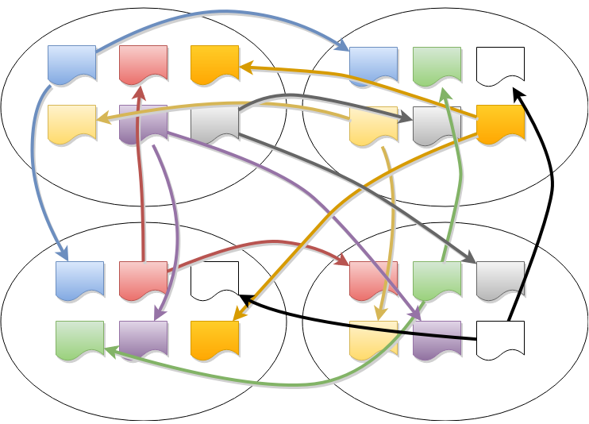

The number of ranges in a distributed database is significantly greater than the number of nodes – this helps improve recovery times when a node fails by keeping ranges small. However, this also results in many ranges having overlapping memberships.

To manage this situation efficiently, MultiRaft is used. Instead of running Raft independently for each range, MultiRaft manages all of a node's ranges as a group. This means that each pair of nodes only needs to exchange heartbeats once per tick, regardless of how many ranges they share.

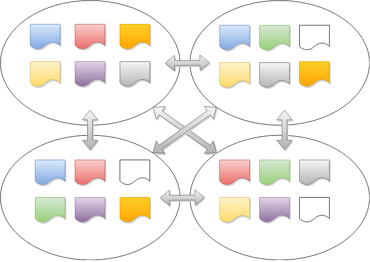

### The Life of a Distributed Transaction

CockroachDB manages distributed transactions by coordinating data across multiple nodes to ensure consistency and reliability. When a transaction is initiated, it follows a process involving intent writing, consensus through the Raft protocol, and commit or rollback decisions.

Each transaction interacts with the distributed system in a way that ensures atomicity, consistency, isolation, and durability (ACID). This approach allows CockroachDB to handle complex operations efficiently, even in a distributed environment, ensuring data integrity and fault tolerance.

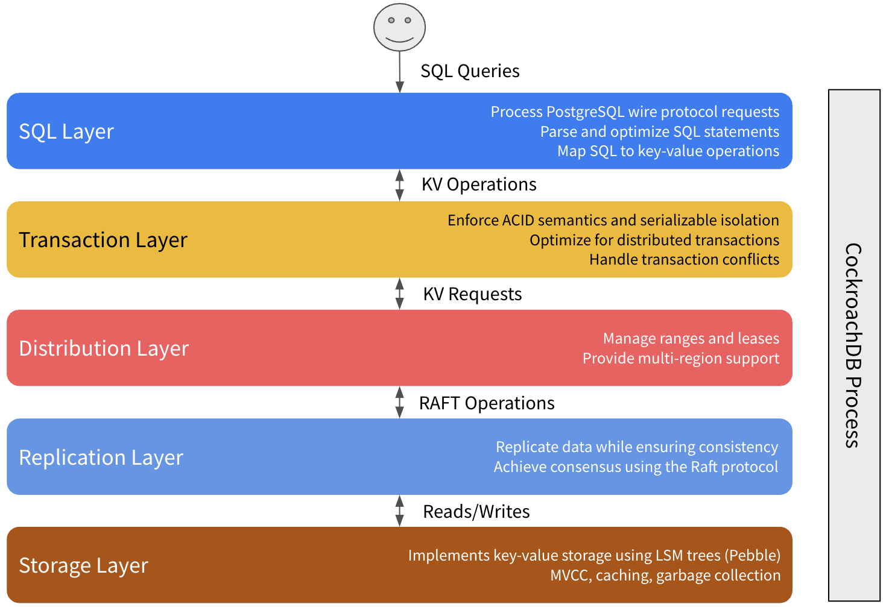

To begin the transaction, a SQL client (e.g., an app) performs some kind of business logic against your CockroachDB cluster, such as inserting a new customer record. This request is sent over a connection to your CockroachDB cluster that's established using a PostgreSQL driver. The gateway node handles the connection with the client, both receiving and responding to the request.

As we explained earlier, all CockroachDB nodes have perfectly symmetrical access to data (Multi-Active). This means your load balancer can connect your client to any node in the cluster and access any data while still guaranteeing strong consistency.

The gateway node first [parses](https://www.cockroachlabs.com/docs/v24.1/architecture/sql-layer#sql-parser-planner-executor) the client's SQL statement to ensure it's valid according to the CockroachDB dialect of SQL, and uses that information to [generate a logical SQL plan](https://www.cockroachlabs.com/docs/v24.1/architecture/sql-layer#logical-planning). Given that CockroachDB is a distributed database, though, it's also important to take a cluster's topology into account, so the logical plan is then converted into a physical plan—this means sometimes pushing operations onto the physical machines that contain the data.

While CockroachDB presents a SQL interface to clients, the actual database is built on top of a [key-value store](https://www.cockroachlabs.com/docs/stable/architecture/overview.html#overview). To mediate this, the physical plan generated at the end of SQL parsing is passed to the SQL executor, which executes the plan by performing key-value operations through _TxnCoordSender_. For example, the SQL executor converts _INSERT_ statements into _Put()_ operations.

The gateway node receives _BatchRequests_ from the _TxnCoordSender_. It dismantles the initial _BatchRequest_ by taking each operation and finding which physical machine should receive the request for the range — known as the range's leaseholder. The address of the range's current leaseholder is readily available in both local caches, as well as in the [cluster's meta ranges](https://www.cockroachlabs.com/docs/v24.1/architecture/distribution-layer#meta-range-kv-structure).

All write operations also propagate the leaseholder's address back to the _TxnCoordSender_, so it can track and clean up write operations as necessary.

The gateway node sends out the first _BatchRequest_ for each range in parallel. As soon as it receives a provisional acknowledgment (ACK) from the leaseholder node’s evaluator, it sends out the next _BatchRequest_ for that range.

The gateway node then waits (PENDING status) to receive acknowledgments for all of its write operations, as well as values for all of its read operations. However, this wait isn't necessarily blocking, and the gateway node may still perform operations with ongoing transactions.

In terms of executing transactions, the Raft leader receives proposed Raft commands from the leaseholder. Each Raft command is a write that is used to represent an atomic state change of the underlying key-value pairs stored in the storage engine.

All operations (including writes) begin by reading from the local instance of the [storage engine](https://www.cockroachlabs.com/docs/v24.1/architecture/storage-layer) to check for write intents for the operation's key.

For write operations, and after guaranteeing that there are no existing write intents for the keys, _BatchRequest_ operations (KV operations) are converted to [Raft operations](https://www.cockroachlabs.com/docs/v24.1/architecture/replication-layer#raft) and have their values converted into write intents.

If an operation encounters a write intent for a key, it attempts to resolve the write intent by checking the state of the write intent's transaction (COMMITTED, ABORTED, PENDING, MISSING).

If the read doesn't encounter a write intent and the key-value operation is meant to serve a read, it can simply use the value it read from the leaseholder's instance of the storage engine. This works because the leaseholder had to be part of the Raft consensus group for any writes to complete, meaning it must have the most up-to-date version of the range's data. The leaseholder aggregates all read responses into a _BatchResponse_ that will get returned to the gateway node.

Once the command achieves consensus (i.e., a majority of nodes – including itself – acknowledge the Raft command), it is committed to the Raft leader’s Raft log and written to the storage engine. At the same time, the Raft leader also sends a command to all other nodes to include the command in their Raft logs.

Once the leader commits the Raft log entry, it’s considered committed. The SQL interface then responds to the client, and is now prepared to continue accepting new connections. At this point the value is considered written, and if another operation comes in and performs a read from the storage engine for this key, they’ll encounter this value.

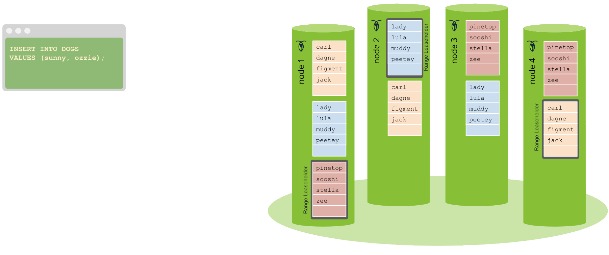

# References

1. D Ongaro — [In Search of an Understandable Consensus Algorithm](https://web.stanford.edu/~ouster/cgi-bin/papers/raft-atc14.pdf). Diego Ongaro and John Ousterhout. Stanford University.
2. [RAFT Visualization](https://raft.github.io/).
3. C. Custer, [What are distributed databases, and how do they work](https://www.cockroachlabs.com/blog/what-is-a-distributed-database/), Cockroach Labs Blog.
4. [Life of a distributed transaction](https://www.cockroachlabs.com/docs/stable/architecture/life-of-a-distributed-transaction), Cockroach Labs Blog.
