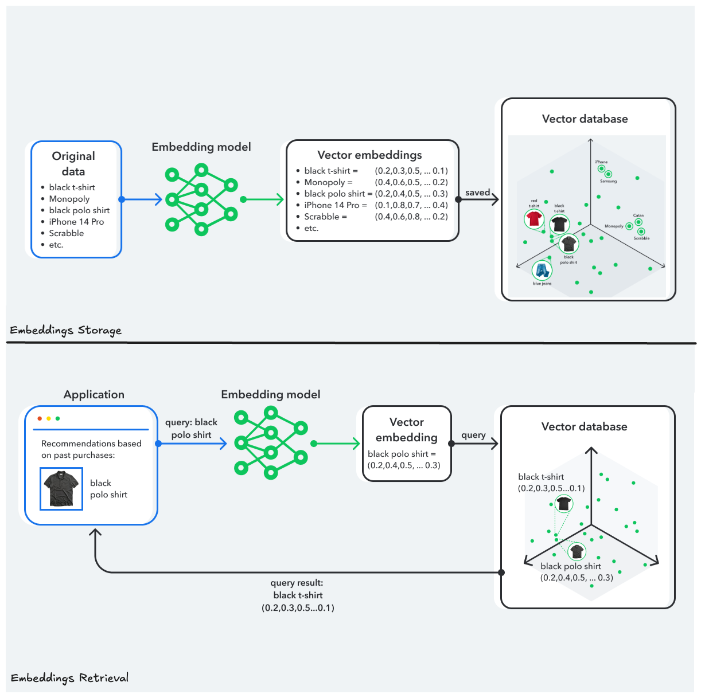

# Getting Started with GenAI Using CockroachDB

Information today is generated and consumed in unprecedented magnitudes. With every click, swipe, and transaction, massive amounts of data are collected, waiting to be harnessed for insights, decision-making, and innovation. Today, more than 80% of the data that organizations generate is unstructured – and the amount of this data type will only grow in the coming decades.

Unstructured data is high-dimensional and noisy, making it more challenging for traditional databases to analyze and interpret using traditional methods.

## Let’s go inside GenAI

Enter the world of Generative AI (GenAI) – a groundbreaking technology that’s revolutionized how we store, query, and analyze data. Behind the magic of GenAI lies a deep stack of technology, data structures, and mathematical innovations.

One of the most foundational — yet often overlooked — components is the use of vector embeddings.These high-dimensional representations allow GenAI models to understand, organize, and generate meaningful content. To make sense of these embeddings at scale, we need specialized systems like vector databases. These databases are not just an evolution of their predecessors; they represent an extraordinary leap in data management.

# What Is Generative AI?

Generative AI represents a class of artificial intelligence algorithms capable of creating original content – text, images, music, code, or even videos. Unlike traditional AI systems that make predictions based on fixed outputs and/or can merely analyze or classify existing data, generative models can produce new and contextually relevant outputs based on prompts and inputs.

_AI Taxonomy_

These systems learn the underlying probability distributions of the data they're trained on and then generate new examples that resemble the original data without directly copying it. The “generative” part comes from sampling these learned distributions to produce new outputs. This ability to "create" rather than "recognize" represents a significant advancement in the field of AI.

This process isn’t random — it’s guided by mathematical representations of data called **Vector Embeddings,** and a set of retrieval techniques called **Vector Similarity** (VecSim).

## Vector Embeddings

Generative AI models don’t "understand" language the way humans do. To understand human text (also called natural language), Large Language Models (LLMs) are Natural Language Processing (NLP) models designed to understand and generate natural language in advanced ways. These models are typically based on neural networks. They can process large amounts of text data to perform various tasks, such as machine translation, text generation, sentiment analysis, text comprehension, question answering, and more.

However, LLMs need a way to represent, navigate, and search this text. This is where the concept of **Vector** comes in. **Vectors** are mathematical representations of data points where each vector dimension ( **embeddings**) corresponds to a specific feature or attribute of the data — to determine relationships and generate plausible continuations of input prompts.

Think of vector embeddings as GPS coordinates for meaning. Just as GPS helps locate a physical place, embeddings help locate the meaning of content in a multidimensional space, enabling similarity comparison, clustering, and retrieval.

_Vector embeddings as GPS coordinates for meaning._

In machine learning and natural language processing, text, images, or other unstructured data can be represented as vector embeddings – each embedding captures an attribute of this data. For example, a product image can be represented as a vector, where each embedding represents a specific characteristic of this product (brand, color, shape, size…, etc.).

Vectors efficiently represent raw unstructured data that can be high-dimensional and sparse (e.g., natural languages, images, audio…). Vector embeddings solve a fundamental problem in AI: how to represent non-numerical data (like text or images) in a form that algorithms can process mathematically. This transformation allows:

1. **Capturing semantics** - The meaning and nuances of data are preserved
2. **Performing calculations** - We can measure similarities, perform conceptual additions or subtractions
3. **Reducing dimensionality** - Complex concepts are represented in a compact and efficient manner

Thanks to advances in deep learning, model providers such as OpenAI, Anthropic, HuggingFace, Cohere, and other data scientists around the world have built models — called **transformers** — capable of transforming almost any data "entity" into its vector representation. Next, using mathematical approaches, these representations are compared in a vector search space to measure how closely related two pieces of data are.

_Transforming Unstructured Data to Vector Embeddings._

## Vector Similarity Search

Vector search, also known as “similarity search,” finds items in a dataset that are closest to a query based on their embeddings.

Vector similarity metrics enable the measurement of similarity or dissimilarity between data points. Unlike keyword-based search, which relies on exact matches, vector search captures [semantic relationships](https://www.cockroachlabs.com/blog/semantic-search-using-cockroachdb/) between data points. Words or phrases with similar meanings (semantics) are represented as vectors that are close to each other in the embedding space. This enables models to understand and reason about the meaning of words and text and solves the following problems:

- **Ambiguity in queries**: Users don’t need precise terms; vector search understands intent.
- **Multimodal data**: It handles text, images, or audio by comparing embeddings across formats.
- **Scalability**: It efficiently processes large datasets, like e-commerce catalogs or media libraries.

_Distance (similarity) between vectors in a vector search space._

## ChatGPT: How it works

In fact, when you submit a prompt into an LLM (let’s consider a ChatGPT prompt), first it's broken down into tokens (units smaller than words, often sub-words). Each token is then converted into an initial embedding vector. This initial layer of embeddings captures basic lexical information.

The Transformer architectures that underpin these models use attention mechanisms to enrich these initial embeddings with contextual information. At each neural network layer, the embeddings are refined to incorporate more context, reflecting deeper semantic understanding and creating what we call "contextual embeddings." The final layer outputs new embeddings, which are decoded into words or actions.

When generating text, the LLM uses the contextual embeddings of previous tokens to predict the most probable next token. This process happens by:

1. Transforming the contextual embedding into a probability distribution over the vocabulary
2. Sampling this distribution to select the next token
3. Calculating a new embedding for this token
4. Repeating the process to generate a coherent sequence

_How LLMs work?_

This intelligent use of embeddings allows LLMs to produce text that maintains coherence, respects grammatical rules, and remains relevant to the context. It enables powerful use cases like semantic search and classification, where it's essential to find not just exact matches but also conceptually similar content. By leveraging vector similarity, systems can understand and retrieve relevant information even when the exact wording or structure differs.

Vector similarity search also powers applications like recommendation engines, allowing personalized recommendations based on deep similarity to a user’s past interests. This delivers personalized and context-aware experiences beyond simple filters or rules (e.g., [Netflix](https://www.cockroachlabs.com/blog/netflix-dbaas-roachfest24-recap/) suggesting shows).

It can also help categorize content, detect spam, analyze sentiment, retrieve images (finding visually similar photos), and map data into a space where similar items group naturally, even without labels. VSS relies on distance metrics like [cosine similarity](https://www.geeksforgeeks.org/cosine-similarity/) or [Euclidean distance](https://www.geeksforgeeks.org/euclidean-distance/) to compare embeddings and determine how alike they are.

GenAI systems use Vector Similarity Search (VSS) as a mathematical backbone to retrieve content based on semantic similarity rather than exact data matching: When a user enters a query, it is converted into an embedding. The system then finds the most similar vectors — and thus the most relevant results — from a **Feature Store** or, commonly, a **Vector Database**.

_Vector databases._

# Storage and Retrieval of Embeddings

## Why do vector databases matter?

Vector databases are designed to store unstructured data as vectors and to handle a large volume of vector embeddings. They use specialized indexing techniques, like approximate nearest neighbor (ANN) search, to quickly find stored vectors similar to a query vector. For example, in a recommendation system, a vector database can retrieve products with embeddings closest to a user’s profile in milliseconds, even across millions of items.

Vector databases must also support hybrid search, combining vector similarity with traditional filters and enhancing flexibility. Just imagine that you are looking for a specific product by its image using a vector similarity search, but you want to enhance your search by adding some other search parameters like your current location or a price range.

Without vector databases, managing embeddings would be slow and resource-intensive, limiting the scalability of GenAI systems. Their ability to store, index, and retrieve embeddings efficiently makes them indispensable for modern AI workflows.

## Challenges of OLTP databases in handling vector embeddings

Vector search, once a niche capability confined to specialized vector databases, is rapidly becoming a commodity feature in traditional databases. As the use of embeddings expands across applications like semantic search, recommendation engines, and AI-driven insights, more developers and organizations expect their traditional databases to directly support operations like nearest neighbor search, hybrid search and cosine similarity.

However, storing and retrieving embeddings efficiently is critical for traditional databases. It often requires workarounds, like serializing vectors into blobs, which complicates retrieval. Enterprise-grade AI applications handle vectors that are high-dimensional, often containing hundreds or thousands of dimensions, making them challenging to manage at scale. This volume poses considerable challenges such as:

1. Efficient storage of large quantities of high-dimensional vectors
2. Fast retrieval for nearest neighbors
3. Continuous updating of vector collections

Moreover, Online Transaction Processing (OLTP) databases, like Oracle or SQL Server, present significant scaling limitations for the billions of vectors needed in modern AI applications, making them the worst choice for AI workloads. In fact, as datasets grow, dynamic scalability becomes critical to maintain performance without re-architecting the GenAI system.

Another key issue is metadata management, where systems need to associate vectors with rich metadata to enable hybrid search and advanced filtering. Additionally, vector indices can be memory-intensive, leading to high resource consumption. Frequent updates, such as adding new vectors, can also trigger costly index rebuilds or maintenance, impacting latency and availability.

## The Critical Role of Data Consistency in GenAI

Data consistency is the foundation of reliable AI, particularly for GenAI. Inconsistent data—mismatched embeddings, outdated vectors, or corrupted inputs—can lead to poor model performance, generating irrelevant or incorrect outputs.

For LLMs, consistency ensures that training and inference data align. If embeddings used during training differ from those at inference (e.g., due to preprocessing errors), the model may misinterpret inputs, reducing accuracy. In recommendation systems, inconsistent user or item embeddings can result in irrelevant suggestions, eroding trust.

GenAI applications often involve real-time data, such as user interactions or live content. Vector databases must maintain consistency across updates to ensure embeddings reflect the latest information. For example, in a news recommendation system, failing to update article embeddings promptly could lead to outdated suggestions.

Consistency also matters for multimodal GenAI, where text, images, and audio embeddings must align. Inconsistent data pipelines can cause mismatches, like pairing an image with the wrong caption. Robust data governance, versioned embeddings, and atomic updates in vector databases help mitigate these risks, ensuring GenAI delivers reliable, high-quality results.

# CockroachDB as a Vector Database

Integrating CockroachDB in your technological stack is a strategic move for modernizing legacy systems and preparing for the demands of AI-driven applications. With its built-in Vector datatype, the strong consistency, and a 99.999% SLA in its cloud offering, [CockroachDB](https://www.cockroachlabs.com/product/overview/) delivers the performance and availability required for today’s next-gen workloads.

To meet this demand, CockroachDB’s [Vector Search implementation](https://www.cockroachlabs.com/blog/vector-search-pgvector-cockroachdb/) uses the same interface as that of PostgreSQL pgvector’s and aims to be compatible with its API. This evolution eliminates the need for separate vector databases in many use cases, enabling teams to leverage familiar tools while adding AI-native capabilities — effectively blurring the lines between classical OLTP systems and modern AI infrastructure.

Additionally, CockroachDB’s limitless horizontal scalability allows you to store and query hundreds of millions or even billions of vector embeddings without sacrificing performance or reliability, which are essential for real-time GenAI applications. These fast queries are made possible with our implementation of Cockroach-SPANN, an internally developed distributed vector indexing algorithm that was made available v25.2. As your data footprint expands, CockroachDB automatically scales out — eliminating the need for manual sharding or complex reconfiguration while ensuring seamless performance and operational simplicity.

Beyond CockroachDB’s resilience and data domiciling capabilities, its distributed architecture enables powerful, SQL-native operations on vector data — bringing analytical depth to your generative AI applications.

For example, if you store items with associated store locations and product images (encoded as vectors) in a single table, you can create a secondary index on the store location column to pre-filter data before performing a Vector Search. This means that instead of scanning the entire dataset, the system first narrows down the search to relevant locations — such as “_Casablanca_” — and then applies vector similarity search only within that subset. This hybrid search approach significantly improves query performance and resource efficiency, making it easier to build intelligent, high-performance AI applications at scale using familiar SQL syntax.

As a highly resilient distributed database, CockroachDB offers the technical foundations to store, index, and query vector embeddings. It allows developers to store vectors as easily as structured relational data. Then, the Vector Search capabilities provide advanced indexing and search capabilities required to perform low-latency search at scale, typically ranging from tens of thousands to hundreds of millions of vectors distributed across a cluster of machines.

CockroachDB’s support for the **pgvector** API enables smooth integration with popular AI frameworks like LangChain, Bedrock and Hugging Face, making it simple to incorporate real-time data into your machine learning workflows. This seamless compatibility positions CockroachDB as a powerful backend for Retrieval-Augmented Generation (RAG) systems, delivering fresh, scalable and consistent data to enrich AI-generated content, all that in the same database you already use for your relational and transactional data.

At Cockroach Labs, we’re also actively developing support for native vector indexing in the upcoming release of CockroachDB. This enhancement will enable the database to efficiently narrow the search space during similarity queries, significantly accelerating execution times and reducing computational overhead.
With vector indexing, CockroachDB further improves the performance of AI and machine learning workloads, reinforcing its position as a powerful, scalable solution for managing large-scale, data-intensive AI applications. So stay tuned for the next articles in this series! We will delve further into the advanced capabilities of CockroachDB as a vector database.
