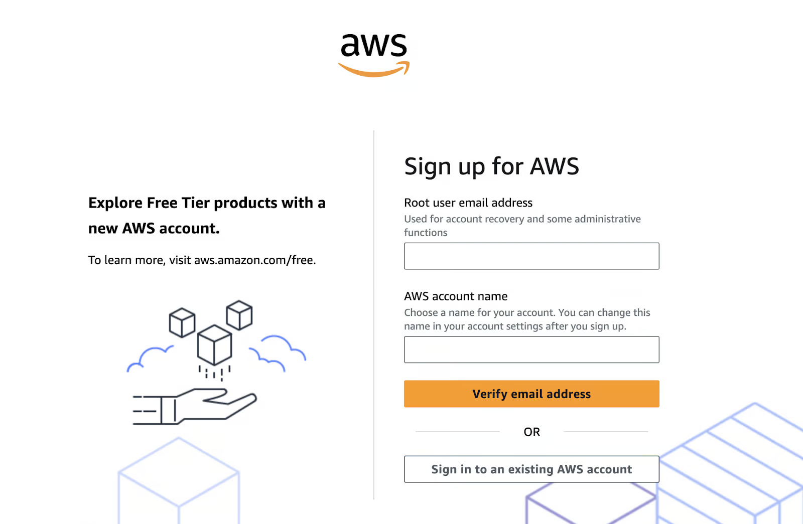

# Amazon Bedrock

## What is Amazon Bedrock?

Amazon Bedrock is a fully managed service that makes high-performing foundation models (FMs) from leading AI companies and Amazon available for your use through a unified API. You can choose from a wide range of foundation models to find the model that is best suited for your use case. Amazon Bedrock also offers a broad set of capabilities to build generative AI applications with security, privacy, and responsible AI. 

Using Amazon Bedrock, you can easily experiment with and evaluate top foundation models for your use cases, privately customize them with your data using techniques such as fine-tuning and Retrieval Augmented Generation (RAG), and build agents that execute tasks using your enterprise systems and data sources.

With Amazon Bedrock's serverless experience, you can get started quickly, privately customize foundation models with your own data, and easily and securely integrate and deploy them into your applications using AWS tools without having to manage any infrastructure. That means:
- No need to provision GPU instances.
- You can focus purely on building applications with a serverless architecture.
- The ease of use reduces setup times significantly, often from weeks to hours.

## Features of AWS Bedrock
AWS Bedrock’s features are designed to simplify and accelerate the journey from AI concept to production. You can use Amazon Bedrock to do the following:

- Experiment with prompts and configurations – Submit prompts and generate responses with model inference by sending prompts using different configurations and foundation models to generate responses. You can use the API or the text, image, and chat playgrounds in the console to experiment in a graphical interface. When you're ready, set up your application to make requests to the InvokeModel APIs.
- Augment response generation with information from your data sources – Create knowledge bases by uploading data sources to be queried in order to augment a foundation model's generation of responses.
- Create applications that reason through how to help a customer – Build agents that use foundation models, make API calls, and (optionally) query knowledge bases in order to reason through and carry out tasks for your customers.
- Adapt models to specific tasks and domains with training data – Customize an Amazon Bedrock foundation model by providing training data for fine-tuning or continued-pretraining in order to adjust a model's parameters and improve its performance on specific tasks or in certain domains.
- Improve your FM-based application's efficiency and output – Purchase Provisioned Throughput for a foundation model in order to run inference on models more efficiently and at discounted rates.
- Determine the best model for your use case – Evaluate outputs of different models with built-in or custom prompt datasets to determine the model that is best suited for your application.
- Prevent inappropriate or unwanted content – Use guardrails to implement safeguards for your generative AI applications.
- Optimize your FM's latency – Get faster response times and improved responsiveness for AI applications with Latency-optimized inference for foundation models.


## Getting Started with AWS Bedrock

This section will guide you through setting up the necessary permissions, creating an AWS account, and getting started with AWS Bedrock.

### Step 1: Creating an AWS account (if not already done)

If you don’t already have one, head to AWS’s sign-up page and create an account. For existing users, ensure your IAM user has administrator privileges.

AWS sign-up page with a form to input a root user email address and AWS account name.



If you are looking for detailed steps, please visit AWS's official guide.

### Step 2: Navigating to AWS Bedrock

Amazon Bedrock is accessible through the AWS Management Console. Follow these steps to locate and start using it:

- Log in to the AWS Management Console: Navigate to AWS Console and enter your login credentials.
- Search for Bedrock: Use the search bar at the top of the console. Type “Bedrock” and select it from the dropdown.


- Explore the Bedrock dashboard: Once on the Bedrock dashboard, you’ll see options for choosing model providers and foundation models.


- Select a model provider and a foundation model:
  - Choose a provider based on your use case (e.g., Amazon Titan for text generation, Stability AI for images, etc.).
  - Explore model-specific options like input types, supported features, and output parameters.
- Run a test inference: AWS Bedrock allows you to run sample inferences directly from the console. This is a great way to get a feel for how each model works before integrating it into your application.


### Step 3: Setting up IAM permissions

AWS Identity and Access Management (IAM) is critical for securely accessing AWS Bedrock. Follow these steps to configure permissions:

- In the AWS Management Console, navigate to the IAM service.
- Click Roles in the sidebar and select Create policy. 
- In Specify permissions, choose “JSON”.


Paste the below policy in the text box:

```json
{
    "Version": "2012-10-17",
    "Statement": [        {
            "Sid": "BedrockFullAccess",
            "Effect": "Allow",
            "Action": ["bedrock:*"],
            "Resource": "*"
        }
    ]
}
```

> **_NOTE:_** The policy above can be attached to any role that needs to access the Amazon Bedrock service. It can be SageMaker or a user. When using Amazon SageMaker, the execution role for your notebook is typically a different user or role than the one you use to log in to the AWS Management Console. To find out how to explore  Amazon Bedrock service using the AWS Console, ensure you authorize your Console user or role. You can run the notebooks from any environment with access to the AWS Bedrock service and valid credentials.

## Using Amazon Bedrock for Generative AI Applications

Generative AI applications are built upon foundation models that are fine-tuned for a particular task, such as text generation, image creation, or data transformation. Following is a step-by-step guide on choosing a foundation model, using basic inference jobs, and modifying model responses to suit your needs.

### Selecting a foundation model
Picking the right foundation model is important because it depends on what your project needs. Here’s how to make a selection:

**1. Identify your use case:**
- Text generation: For tasks like  summarization, content creation, or chatbot development, consider models like:

  - Amazon Titan Text G1: This model generates high-quality text with a good understanding of the context.
  - Anthropic Claude 3: This model is very good at producing text that is coherent and relevant to the context and is thus suitable for conversational AI applications.

- Image generation: If your project is about creating images or any  form of visual content, then Stability AI models are the way to go:
  - Stable Diffusion 3.5 Large: This model is very good at generating pictures from text descriptions, whether photorealistic or artistic.
- Multimodal tasks: For applications that need both text and image processing, Amazon Nova models are recommended:
  - Nova Lite: A cost-sensitive multimodal model that can take text, image, and video input and output text.
  - Nova Pro: A competent multimodal model for more complex tasks.
  
**2. Evaluate model capabilities:** Review the specific strengths of each model to ensure alignment with your project's needs. Detailed information about supported foundation models, including their capabilities and supported regions, is available in the AWS documentation.

### Enabling model access
Before using these models, you need to enable model access within your AWS account. Here are the steps to set it up:

- In the Bedrock Console, navigate to Models access.
- In the Console, click on Modify model access.
- Browse the available models from providers and select the one you like. In this case, I selected Titan Text G1—Express.


- Click Next, and then click on Review and submit.

### Running basic inference

To perform inference using a selected foundation model in AWS Bedrock, follow these steps:
- Set up the AWS SDK for Python (boto3):

```
pip install boto3
```

- Initialize the Bedrock client: Create a Bedrock runtime client in the AWS region of your choice:

```python
import boto3
import json
from botocore.exceptions import ClientError

# Set the AWS Region
region = "us-east-1"

# Initialize the Bedrock Runtime client
client = boto3.client("bedrock-runtime", region_name=region)
```

- Invoke the model: Define the model ID and the input prompt:

```python
# Define the model ID for Amazon Titan Express v1
model_id = "amazon.titan-text-express-v1"

# Define the input prompt
prompt = """
Command: Compose an email from Amine, A Partner Solution Architect at Cockroach Labs, to the Partner team at "AWS" about setting up a GenAI workshop called 'immersion days' """
```

- Format the request payload:

```python
# Configure inference parameters
inference_parameters = {
   "inputText": prompt,
   "textGenerationConfig": {
       "maxTokenCount": 512,  # Limit the response length
       "temperature": 0.5,    # Control the randomness of the output
   },
}

# Convert the request payload to JSON
request_payload = json.dumps(inference_parameters)
```

- Process the response:

```python
try:
   # Invoke the model
   response = client.invoke_model(
       modelId=model_id,
       body=request_payload,
       contentType="application/json",
       accept="application/json"
   )

   # Decode the response body
   response_body = json.loads(response["body"].read())

   # Extract and print the generated text
   generated_text = response_body["results"][0]["outputText"]
   print("Generated Text:\n", generated_text)

except ClientError as e:
   print(f"ClientError: {e.response['Error']['Message']}")
except Exception as e:
   print(f"An error occurred: {e}")
```
> **_NOTE:_** You can access and copy the complete code directly from [here](../assets/module1/bedrock.py).

You can expect the below output:

```
% python3 main.py

Generated Text:

Hi AWS Partner Team,
I'd like to propose a joint GenAI Immersion Days workshop combining CockroachDB's distributed database capabilities with AWS AI services.

Workshop Focus:
- GenAI applications with real-time data using CockroachDB + AWS Bedrock/SageMaker
- Scalable AI architectures with distributed databases
- Hands-on labs and customer use cases

Benefits:
- Joint go-to-market opportunity
- Enhanced customer value proposition
- Complementary technical expertise

Can we schedule a brief call this week to discuss partnership details and next steps?

Best regards,
Amine
Partner Solution Architect
CockroachDB
```

### Customizing the model outputs
To fine-tune the behavior of the model output, you can adjust parameters like `temperature` and `maxTokenCount`:

- `temperature`: This parameter controls the randomness of the output. Lower values increase the determination of the output, and higher values increase the variability.
- `MaxTokenCount`: Sets the maximum length of the generated output.
For example:

```python
# Configure inference parameters
inference_parameters = {
   "inputText": prompt,
   "textGenerationConfig": {
       "maxTokenCount": 512,  # Limit the response length
       "temperature": 0.5,    # Control the randomness of the output
   },
}

# Convert the request payload to JSON
request_payload = json.dumps(inference_parameters)
```

By adjusting these parameters, you can better tailor the creativity and length of the generated content to your application's needs.

# References
- Rahul Sharma — [Amazon Bedrock: A Complete Guide to Building AI Applications](https://www.datacamp.com/tutorial/aws-bedrock). 