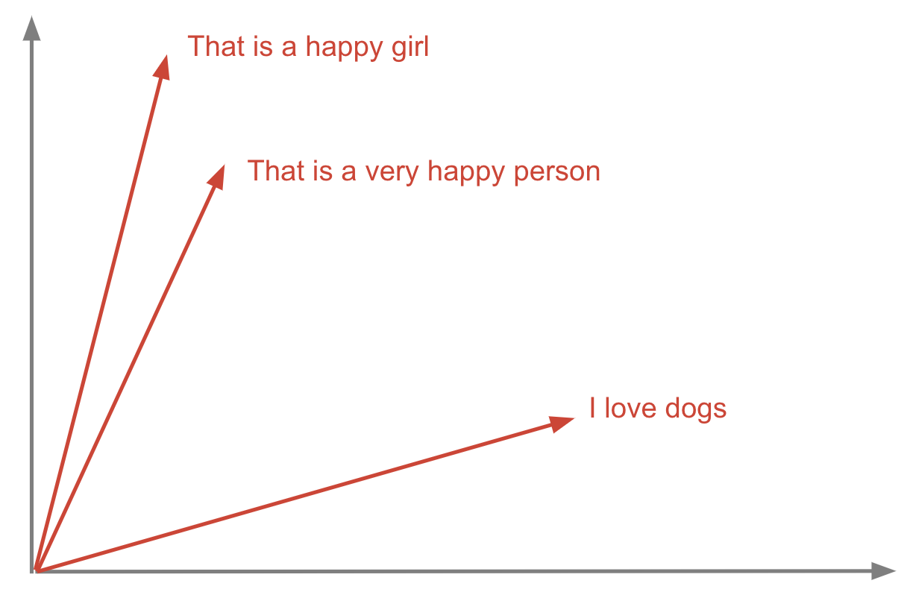
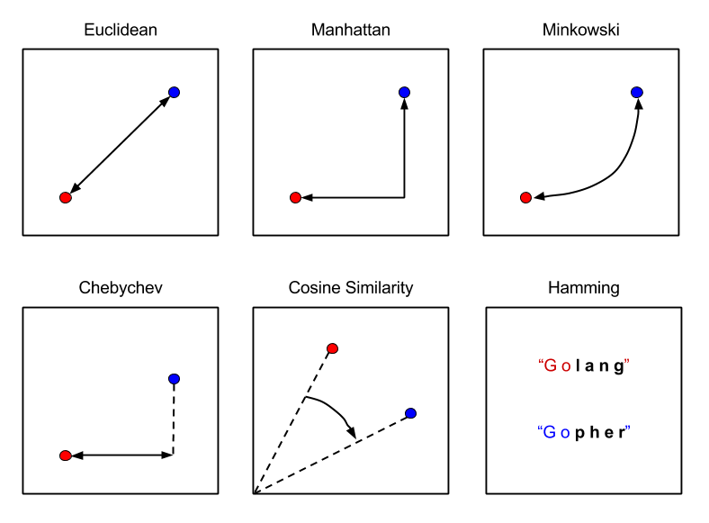
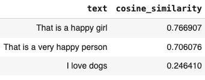
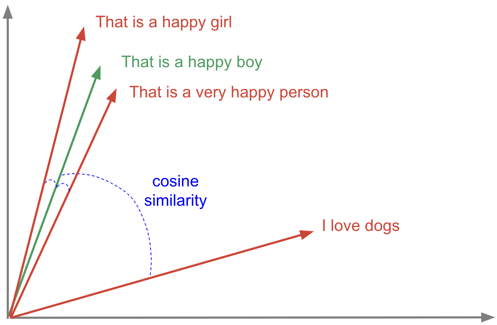
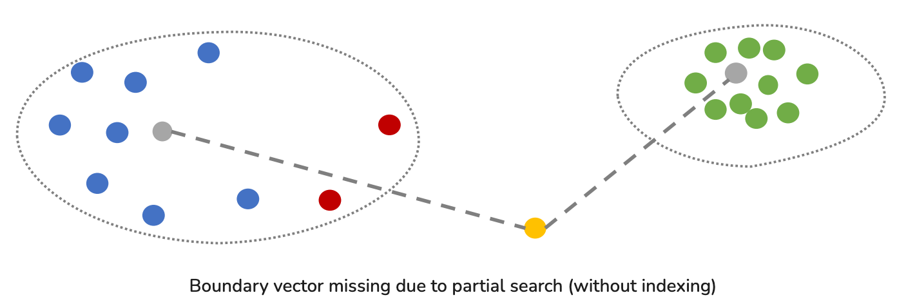
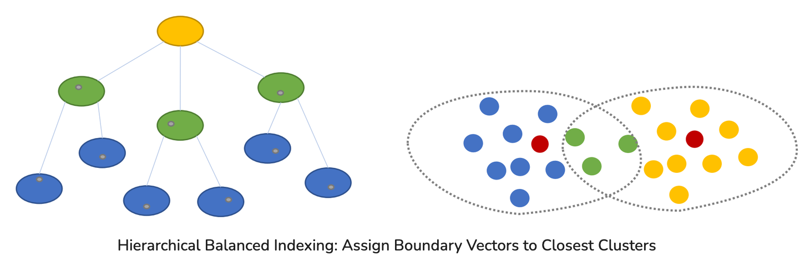

# Vector Similarity Search with CockroachDB
## Creating and Storing Vectors

Let’s take the following example. It depicts how Semantic Similarity Search works in the context of Large Language Models (LLMs). Following are three different sentences we want to represent in a vector search space – each one is transformed into a vector embedding using the _sentence_transformers_ library (from [HuggingFace](https://huggingface.co/sentence-transformers)):

- `That is a happy girl`
- `That is a very happy person`
- `I love dogs`

Packages like HuggingFace’s _sentence_transformers_ provide easy-to-use models for tasks like semantic similarity search, visual search, and many others. To create embeddings with these models, only a few lines of Python are needed:

```python
from sentence_transformers import SentenceTransformer

# 1. Load a pretrained Sentence Transformer model. This model encodes text into a vector of 384 dimensions.
model = SentenceTransformer("all-MiniLM-L6-v2")

# The sentences to encode
sentences = [
"That is a happy girl",
"That is a very happy person",
"I love dogs"
]

# 2. Calculate embeddings by calling model.encode()
vectors = model.encode(sentences).astype(np.float32)
```
First we need to create the table schema before inserting data on it:

```sql
CREATE TABLE sentences (
        text String,
        text_vector VECTOR(384)
);
```

Next, let’s store these sentences and their respective embeddings in CockroachDB:

```python
import psycopg2

# Connect to an existing database
with psycopg2.connect(crdb_url) as conn:

    # Open a cursor to perform database operations
    with conn.cursor() as cursor:
        data = [(sentence, format_embeddings(vector)) for sentence, vector in zip(sentences, vectors)]

        for d in data:
          cursor.execute("INSERT INTO sentences (text, text_vector) VALUES (%s, %s)", d)

        # Make the changes to the database persistent
        conn.commit()
```

The graph below highlights the position of these example sentences in 2-dimensional vector search space relative to one another. This is useful in order to visually gauge how effectively our embeddings represent the semantic meaning of text.


_Sentences represented as vectors._

## Querying Vectors

Let’s assume that we want to compare the three sentences above to a new one: That is a happy boy. We need to use the same model we used for the previous sentences, then create the vector embedding for the query sentence.

```python
# create the vector embedding for the query sentence
query_sentence = "That is a happy boy"
query_vector = model.encode(query_sentence).astype(np.float32)
```

Once the vectors are loaded into CockroachDB, queries can be formed and executed for all kinds of similarity-based search tasks. For this, you need to leverage distance metrics which provide a reliable and measurable way to calculate the similarity or dissimilarity of two vectors.

There exist many distance metrics you can choose depending on your use case, but currently, only the operators **&lt;-&gt;** [Euclidean Distance](https://en.wikipedia.org/wiki/Euclidean_distance) (L2), **&lt;#&gt;** [Inner Product](https://en.wikipedia.org/wiki/Inner_product_space) (IP), and **&lt;=&gt;** [Cosine Similarity](https://en.wikipedia.org/wiki/Cosine_similarity) are available in CockroachDB.


_Distance metrics_

Below is a query that returns the most similar sentences to the new one (That is a happy boy), sorted by distance (cosine similarity):

```python
# Connect to an existing database
with psycopg2.connect(crdb_url) as conn:

    # Open a cursor to perform database operations
    with conn.cursor() as cursor:
        # Query the database and obtain data as Python objects.
        cursor.execute('SELECT text, 1 - (text_vector <=> \'' + format_embeddings(query_vector) + '\') AS cosine_similarity FROM sentences ORDER BY cosine_similarity DESC')
```

Let’s take a look to this query:

```sql
SELECT text, 1 - (text_vector <=> query_vector) AS cosine_similarity FROM sentences ORDER BY cosine_similarity DESC;
```

In this query, we ask the CockroachDB vector search engine to calculate the cosine similarity between the query vector and each one of the vectors already stored in the sentences table, so we can determine how similar the sentences are to each other.

The sentence That is a happy boy is the most similar sentence to That is a happy girl (76% of similarity) and That is a very happy person (70% of similarity), but very far from I love dogs (only 24%).



Running this calculation between our query vector and the other three vectors in the plot above, we can determine how the sentences are semantically similar to each other.


_Calculating distance (similarity) between vectors._

## Optimizing Similarity Search Performance using Vector Indexing

A vector index enables efficient approximate nearest neighbor (ANN) search on high-dimensional VECTOR columns. Vector indexing is used to improve the performance of similarity searches over large datasets, such as embeddings generated by machine learning models.

### Vector Indexing Challenges

One of the key challenges in vector indexing is balancing accuracy with performance. Exact nearest neighbor search methods provide the highest accuracy but become computationally expensive and slow as the number of vectors increases. To address this, many systems adopt Approximate Nearest Neighbor (ANN) algorithms—such as HNSW, IVF, or product quantization—which significantly improve query speed and scalability. However, these algorithms introduce a trade-off: while they reduce latency and resource usage, they may occasionally return results that are less accurate than exact methods. Finding the right balance between recall quality and response time is critical, especially in real-time applications like semantic search or personalized recommendations, where user experience depends on both relevance and speed.

When you perform a similarity search without a propre vector index, the main challenge is that your DB engine will perform a full scan (heavy consumption of resources) of all your data and calculate the similarity metrics to find the closest vectors to your query. 

To check that, you can use the `EXPLAIN` statement that returns CockroachDB's query plan. You can use this information to optimize the query, and avoid scanning the entire table, which is the slowest way to access data. 

Let's apply this statement to the similarity search we performed earlier:

```sql
EXPLAIN SELECT text, 1 - (text_vector <=> query_vector) AS cosine_similarity FROM sentences ORDER BY cosine_similarity DESC;
```

The output shows the tree structure of the statement plan, in this case a sort, and a scan.

```
                                          info
----------------------------------------------------------------------------------------
distribution: full
vectorized: true
• sort
│ estimated row count: 3
│ order: -cosine_similarity
│
└── • render
│
└── • scan
estimated row count: 3 (100% of the table; stats collected 2 minutes ago)
table: sentences@sentences_pkey
spans: FULL SCAN
```

The output also describes a set of properties, some global to the query, some specific to an operation listed in the true structure (in this case, sort, or scan), and sometimes an index recommendation:

- `distribution:full`: The planner chose a distributed execution plan, where execution of the query is performed by multiple nodes in parallel, then the results are returned by the gateway node. An execution plan with full distribution doesn't process on all nodes in the cluster. It is executed simultaneously on multiple nodes. An execution plan with local distribution is performed only on the gateway node. Even if the execution plan is local, row data may be fetched from remote nodes, but the processing of the data is performed by the local node.
- `vectorized:true`: The plan will be executed with the vectorized execution engine.
- `order:-cosine_similarity`: The sort will be ordered descending on the cosine similarity metric.
- `table:sentences@sentences_pkey`: The table is scanned on the sentences_pkey primary index.
- `spans:FULL SCAN`: The table is scanned on all key ranges of the sentences_pkey primary index (also known as a **full table scan** or **unlimited full scan**). 

So, here it is recommended to create an index on `text_vector` to avoid a full scan of the table. 

To enable the use of vector indexes, set the `feature.vector_index.enabled` cluster setting:

```
SET CLUSTER SETTING feature.vector_index.enabled = true;
```

To enable the creation of vector indexes on non-empty tables, also disable the `sql_safe_updates` session setting. This allows vector indexes to be backfilled on existing rows, during which table writes are blocked to ensure vector index consistency. This blocking behavior is a known limitation that is currently being tracked.

```
SET sql_safe_updates = false;
```

To create a vector index, use the `CREATE VECTOR INDEX` statement. So for our earlier example:

```sql
CREATE VECTOR INDEX text_vector_idx ON sentences (text_vector);
```

You can also specify a vector index during table creation. For example:

```sql
CREATE TABLE sentences (
        text String,
        text_vector VECTOR(384),
        VECTOR INDEX (text_vector)
);
```

The second major challenge with the existing vector indexing methods, is that the nearest neighbor vectors of a query vector may locate in the boundary of multiple posting lists. Since we only search a small number of relevant posting lists, some true neighbors of the query vector that located in other posting lists will be missing (Illustrated in the upper figure bellow). Boundary vector are missing from search due to partial search, so the search accuracy is undermined. 

For instance, if you search the yellow point, you will search green posting list first since the centroid of green posting list is closer to the yellow point although there are some boundary points (colored red) in the blue posting list that are much closer.



CockroachDB vector indexes organize vectors into a hierarchical structure of partitions using k-means clustering. This indexing method is based on SPANN, an efficient vector indexing and search system, that follows the inverted index methodology. It provides a hierarchical balanced clustering of vector.

In the figure below, the index iteratively partitions the vectors of a large cluster (yellow cluster) into a small number of small clusters (green clusters) until each cluster only contains limit number of vectors (blue clusters). Thus, it assigns boundary vectors (green points) to multiple closest clusters if its distances to these clusters are nearly the same (blue and yellow clusters).



This partition structure groups similar vectors together and enables efficient, tunable ANN searches. When a query uses a vector index, CockroachDB explores a subset of partitions based on their proximity to the query vector. It then retrieves and evaluates a candidate set of vectors using the configured distance metric and returns the top nearest results.

To address the accuracy challenges, CockroachDB allows tuning Search beam size, using the `vector_search_beam_size` parameter, and the Partition size, using `min_partition_size` and `max_partition_size` parameters:
- To explore more partitions during a search, increase `vector_search_beam_size`. This improves search accuracy by evaluating more of the index, but increases CPU usage and read latency because more partitions are scanned. 
```
SET vector_search_beam_size = 16;
```

- To group more vectors into each partition, increase the partition size with `min_partition_size` and `max_partition_size`. This improves search accuracy by causing more candidate vectors to be evaluated per partition. However, it increases CPU usage and increases read latency because each partition contains more vectors. For the same reason, you can often reduce `vector_search_beam_size` without sacrificing accuracy.
```sql
CREATE VECTOR INDEX text_vector_idx ON sentences (text_vector) WITH (min_partition_size=16, max_partition_size=128);
```
Search accuracy is highly dependent on workload factors such as partition size, the number of VECTOR dimensions, how well the embeddings reflect semantic similarity, and how vectors are distributed in the dataset. Experiment with `vector_search_beam_size`, `min_partition_size`, and `max_partition_size` on a representative dataset to find the optimal setting for your workload.

Because a larger partition size leads to fewer partition splits and merges, it enables faster insert performance. So, to optimize writes, increase the partition size with `min_partition_size` and `max_partition_size`. A larger partition size leads to fewer partition splits and merges, resulting in faster insert performance.

Once you have fine-tuned your vector index, the next EXPLAIN call demonstrates that the span scope is `LIMITED SCAN`. This indicates that the table will be scanned on a subset of key ranges of the index.

```
                            info
--------------------------------------------------------------
  distribution: local
  vectorized: true

  • top-k
  │ estimated row count: 3
  │ order: -cosine_similarity
  │ k: 3
  │
  └── • render
      │
      └── • vector search
            table: sentences@text_vector_idx
            target count: 3
            spans: LIMITED SCAN
```

If you perform this example on a large dataset, you should also see that the estimated row count is around 10% of the table count.