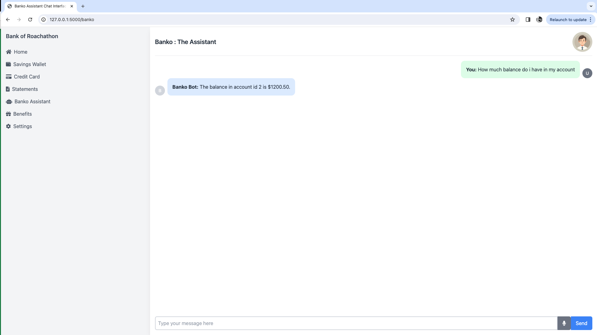
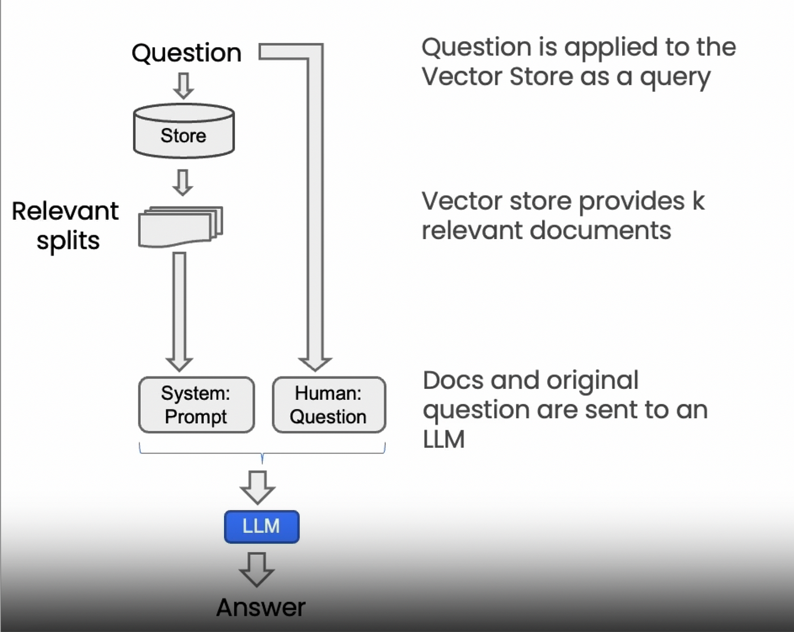
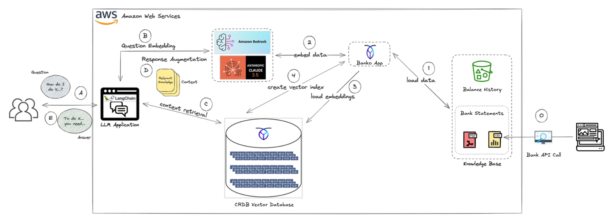

# Banko Assistant App

## Overview
The Banko Assistant is a banking application designed to offer a realistic use case of LLMs and how CockroachDB can integrate with AWS Bedrock to create a seamless and secure banking experiences to its users. Built with Python and Flask, this app leverages the powerful combination of LangChain with SQLToolkit for efficient interaction with CockroachDB, and integrates Large Language Model (LLM) functionalities from AWS Bedrock for an enhanced user experience. 

### Banko Assistant App /Home

The screenshot below depicts the home dashboard of the banking application. You can run this application locally at `<server_name>:3000/home`. In this main user dashboard, the application provides a consolidated view of financial data and activity. On the left side, a vertical sidebar serves as the primary navigation panel. It includes key sections such as Home, Savings Wallet, Credit Card, Statements, Banko Assistant, Benefits, and Settings. 

The central area of the dashboard presents several widgets for financial overview - a pie chart labeled “Expenses by Category”, showing the user’s spending breakdown, and a Transactions widget displays recent activities.

The lower portion of the dashboard includes two graphical widgets: The Spend Analysis section features a line chart tracking monthly spending trends. Next to it, the Yearly Breakdown bar chart visualizing monthly expenditure. A “+ New transaction” button in the bottom right corner invites users to initiate new financial operations, such as transfers or payments.


### Banko Assistant /Banko

The Banko Assistant is a chatbot-style virtual assistant integrated into the Banko application. The page is located at the /banko route (`<server_name>:3000/banko`). 

On the left-hand side, the consistent sidebar navigation remains visible, offering access to different banking features such as Home, Savings Wallet, Credit Card, Statements, Benefits, and Settings. Highlighted in the menu is Banko Assistant, which is the currently active view.

The main area is a clean chat interface titled “Banko: The Assistant”, which simulates a natural conversation between the user and the banking assistant bot. In this instance, the user can asked questions such as “How much balance do I have in my account?” or “Can you display all card debit from the month of April?”. 

The bot uses Large Language Models and Retrieval Augmented Generation (RAG) to understand the prompt, find the relevant context and data, then to generate responses in a human language.

This assistant functionality relies on backend integration with the user’s account data, used as a context, and integrates with foundation LLM models from AWS Bedrock to understand user intent and to provide human-like and context-based answers. As part of a modern banking experience, it offers quick access to personalized insights, such as account balances, recent transactions, or credit card details, all through a simple chat interface.



## Features
- **Natural Language Interface**: Query your expense data using everyday language
- **AI-Powered Responses**: Leverages Claude 3.5 Sonnet via AWS Bedrock for intelligent responses
- **Expense Search**: Quickly find and analyze your spending patterns
- **Interactive Chat UI**: Clean, intuitive interface for seamless conversations
- **Secure Session Management**: Maintains conversation history within user sessions
- **Banking Dashboard**: Integrated with a comprehensive banking interface

## Technical Stack
- **Backend**: Flask (Python)
- **AI/ML**:
    - AWS Bedrock for LLM capabilities
    - Claude 3.5 Sonnet model
    - Sentence Transformers for embeddings
    - OpenAI models
    - Open Source Models
- **Database**: CockroachDB
- **Frontend**: HTML, Tailwind CSS
- **Cloud Infrastructure**: AWS

## Retrieval Augmented Generation (RAG)

A domain-specific chatbot such as the Bank application is an intelligent conversational interface tailored to operate within a particular industry or functional area. Unlike general-purpose chatbots (like virtual assistants that answer broad questions), a domain-specific chatbot is optimized for a focused use case with personalized context. These chatbots are designed with specialized vocabulary, workflows, data integrations, and decision logic that align with the needs of a specific domain and within a specific context.

Domain-specific chatbots rely on the concept of Retrieval Augmented Generation (RAG). The strength of a domain-specific assistant using RAG like the Banko App is its ability to deliver high-value interactions while staying aligned with the operational goals of the banking system—speed, precision, user personalization, and compliance. As financial services continue to adopt AI-driven interfaces, domain-specific bots like this one become crucial tools for enhancing customer experience while automating routine queries.

Retrieval Augmented Generation (RAG), within the scope of Large Language Models (LLMs), is a technique that combines the knowledge of domain-specific data and generative models to enhance the production of contextually-rich question responses. In essence, RAG functions by retrieving relevant information from a knowledge base of documents or data before proceeding to generate a response. This allows generalized foundation models to gain access to these data sources at runtime, and is NOT the same thing as fine-tuning.



RAG exploits the strengths of CockroachDB as a distributed vector database for efficient retrieval operations and AWS's Bedrock to generate a coherent text response. In LLM applications, RAG enables a deeper comprehension of context, returning highly nuanced responses, even to intricate queries. This pattern enhances the interactive capability of applications, delivering more precise and informative responses, thereby significantly enriching the user experience.

In order to build a RAG pipeline for question answering, we need to use Bedrock API with an LLM for text generation (e.g., `anthropic.claude-v3.5`). With the comprehensive capabilities of Amazon Bedrock, you can easily experiment with a variety of top FMs, privately customize them with your data using techniques such as fine-tuning and retrieval augmented generation (RAG), and create managed agents that execute complex business tasks—from booking travel and processing insurance claims to creating ad campaigns and managing inventory—all without writing any code. 

Since Amazon Bedrock is serverless, you don't have to manage any infrastructure, and you can securely integrate and deploy generative AI capabilities into your applications using the AWS services you are already familiar with.



The diagram above illustrates a Retrieval-Augmented Generation (RAG) architecture for a domain-specific banking assistant powered by large language models (LLMs), vector search, and a CockroachDB (CRDB) vector database. The flow shows how the system processes user questions, retrieves relevant knowledge, and generates accurate, contextual answers using LLMs and structured bank data.

### 🧠 Key Components and Flow Explanation

#### Step 1: Load Data

The Banko App loads structured banking data from a Knowledge Base, which includes:

Balance History (likely from an object store such as Amazon S3)

Bank Statements in formats like PDF and CSV

This raw data is prepared for embedding.

#### Step 2: Embed Data
The Banko App sends this data to Amazon Bedrock, specifically using models like Anthropic Claude 3.5, to generate embeddings—dense vector representations of the data's semantic meaning.

#### Step 3 & 4: Load Embeddings and Create Index
Once generated, these embeddings are stored in a CockroachDB vector database, where the system also creates a vector index. This enables fast similarity searches to retrieve relevant content based on the meaning of incoming queries.

### 💬 RAG Workflow with LangChain and LLM

#### A. User Question
A user asks a question like “How do I do X…?” through a chatbot interface powered by LangChain.

#### B. Question Embedding
The question is sent to Amazon Bedrock, where it is transformed into an embedding vector using the same model as before, ensuring alignment with the embedded documents.

#### C. Context Retrieval
The embedding of the question is used to perform a semantic search in the CRDB vector database, retrieving the most relevant chunks of banking knowledge.

#### D. Response Augmentation
The retrieved context—such as balance information, transaction history, or statement metadata—is added to the prompt and sent back to the LLM via LangChain. This step ensures that the LLM has the necessary context to generate accurate answers, even if it wasn't pre-trained on this specific data.

#### E. Answer Generation
The LLM processes the question along with the augmented context and responds with a helpful, domain-aware answer. For example: “To do X, you need to access your credit card statement via the Statements tab.”

### 🗂️ Technologies Used
- Amazon Bedrock + Claude 3.5: Provides embedding generation and LLM capabilities.
- LangChain: Orchestrates the workflow between user input, embedding, retrieval, and generation.
- CockroachDB: Stores vector embeddings and serves as a scalable, consistent backend for secure, high-availability vector search.
- Banko App: Acts as the integration layer between the knowledge base, CRDB, and LLM services.

### ✅ Benefits of This Architecture
- Domain-specific intelligence: Provides accurate, contextual financial answers tailored to user data.
- Strong consistency: CRDB ensures that access to financial data is correct and up-to-date.
- Scalability and availability: Works across regions and remains resilient to infrastructure failures.
- Seamless augmentation: Combines the reasoning of LLMs with the precision of structured data retrieval.

### Prerequisites
- Python 3.8+
- AWS account with Bedrock access
- CockroachDB instance
- OpenAI API key (for certain functionalities)

### Installation
1. Clone the repository

```
git clone https://github.com/david7joy/banko-ai-assistant.git
```

2. Install dependencies
3. 
```
pip install -r requirements.txt
```

3. Configure your environment
    - Create a `config.py` file with your API keys
    - Configure AWS credentials for Bedrock access

4. Run the application

```
python app.py
```

5. Access the application at `http://<server-name>:3000/home`

## Usage
1. Navigate to the Banko Assistant section from the sidebar
2. Type your financial query in natural language (e.g., "How much did I spend on restaurants last month?")
3. Receive AI-generated responses based on your expense data
4. Continue the conversation to explore your finances further

## Project Structure
- `app.py`: Main Flask application
- `aws_bedrock.py`: Functions for AWS Bedrock integration
- `bedrock_search.py`: Implementation of AWS Bedrock search capabilities
- `cockroachdb/`: use the code available to create schema, generate sample data and even test search capabilities.
- `templates/`: HTML templates for the web interface
    - `index.html`: Chat interface
    - `dashboard.html`: Banking dashboard